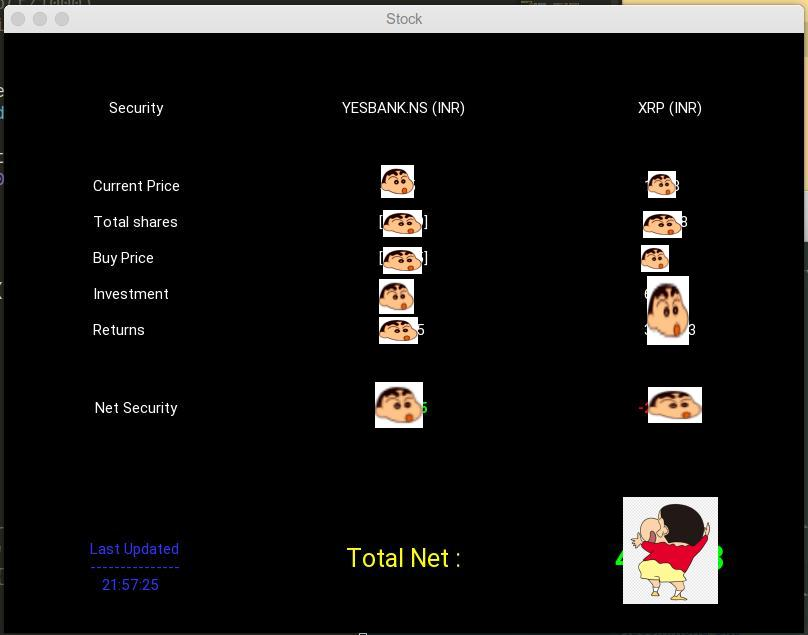
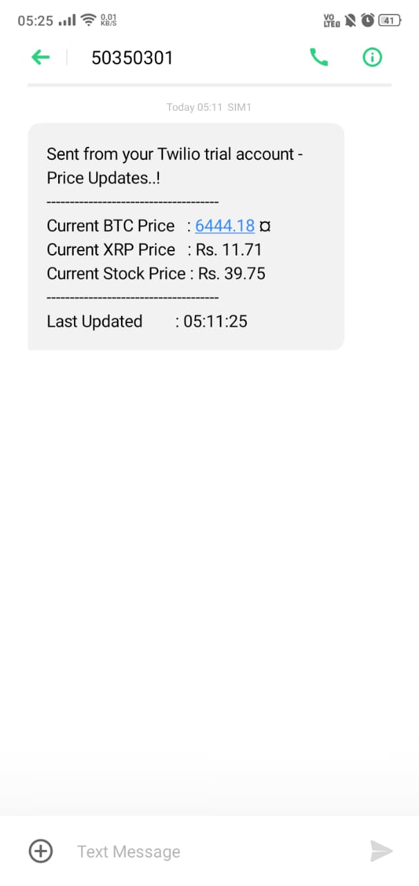

# Stock Tracker Family

I recently started trading in Indian Stocks and Cryptos. It's really fun to check the prices and movements by logging into my waller account again and again and again and again and again and again and again and again and again and again.............wait...is it?

Then I asked myself, who am I?

*....programmer............* (echoes)

And what is a programmer best at? Being lazy!

Wait, before you send me hate e-mails, I meant, being **<i>SMART_LAZY</i>**!

Thus, I built this little family of my own that contains (branches):
* stock-app : An android app that shows me my profile of securities and some analysis.
* stock-web : If created an app, why not a webApp too?
* stock-notify : A cloud script that works for me 24/7 to notify me if there is any sudden movement in the price action of a few things that I put on it, so that I'll be notified when I'm working out that it's time to make some money dude!

NOTE: The so called 'App' was not deployed successfully on Android as 'pandas build recipe' has not been published yet. But, if anyone has a workaround, please feel free to contribute.

## Samples

